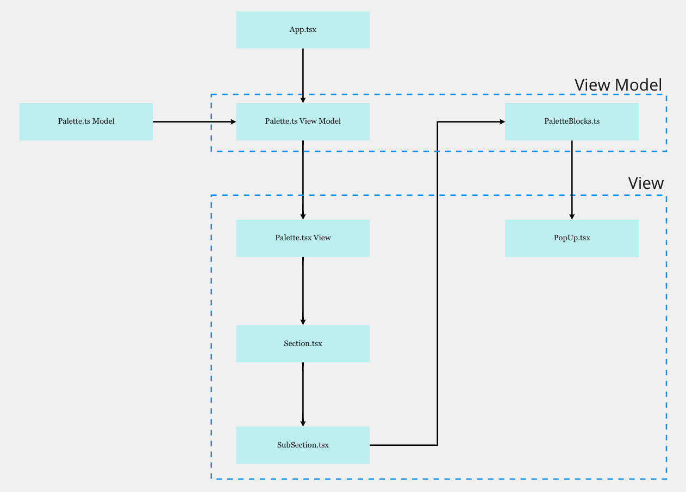
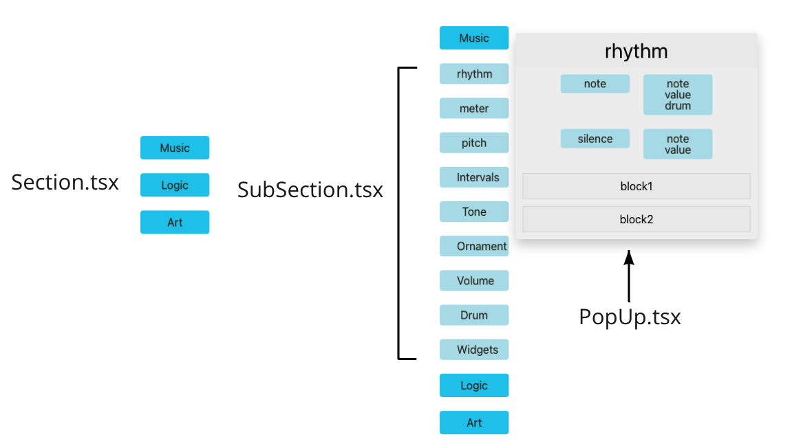
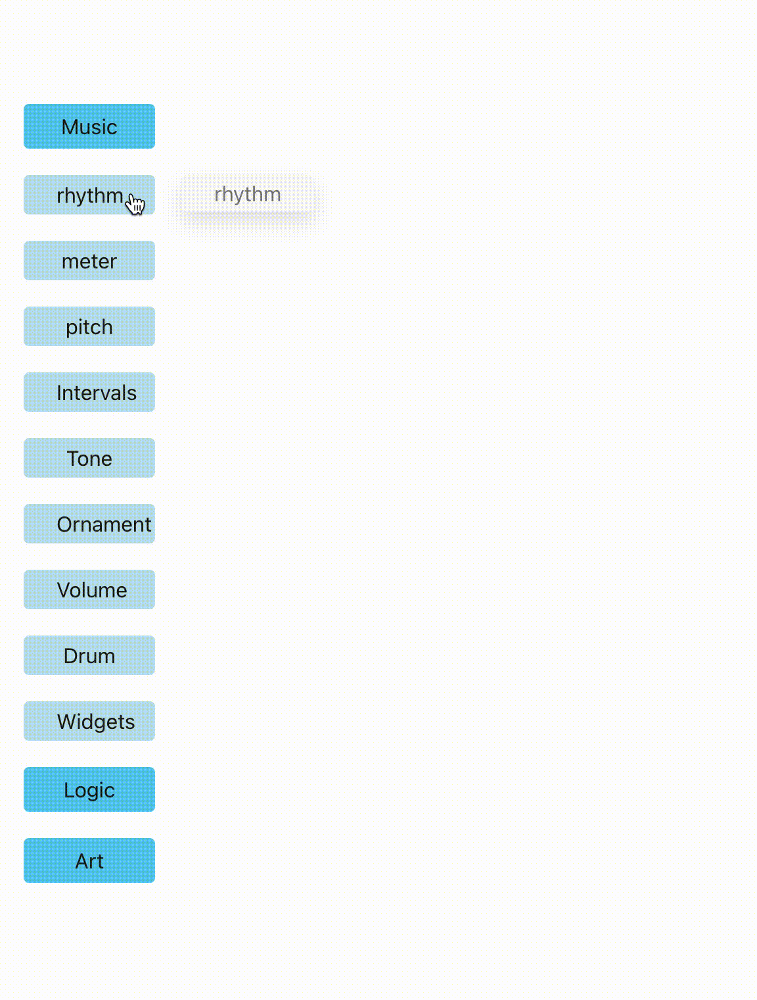
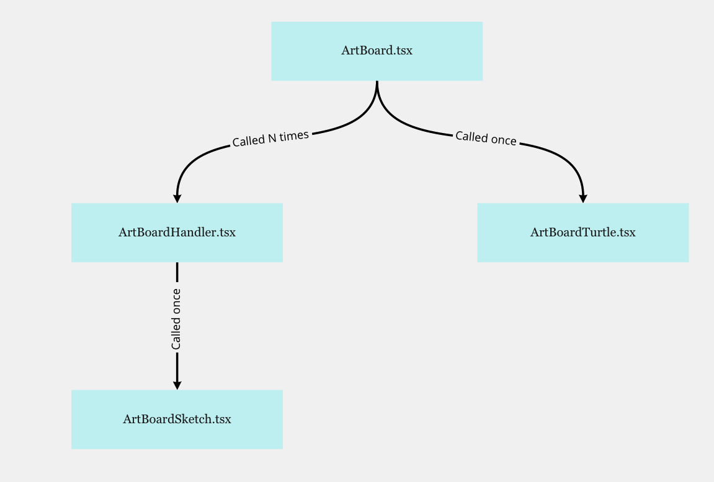
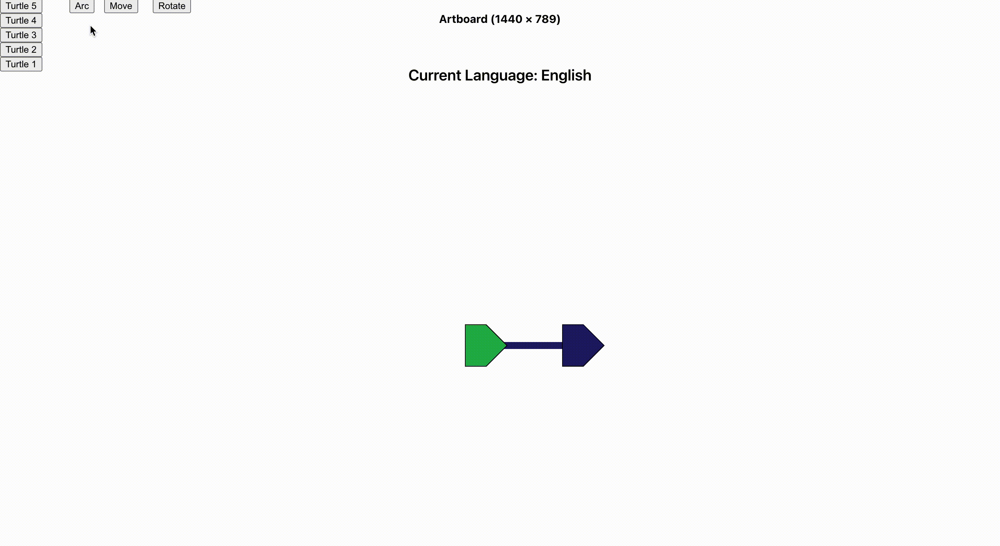
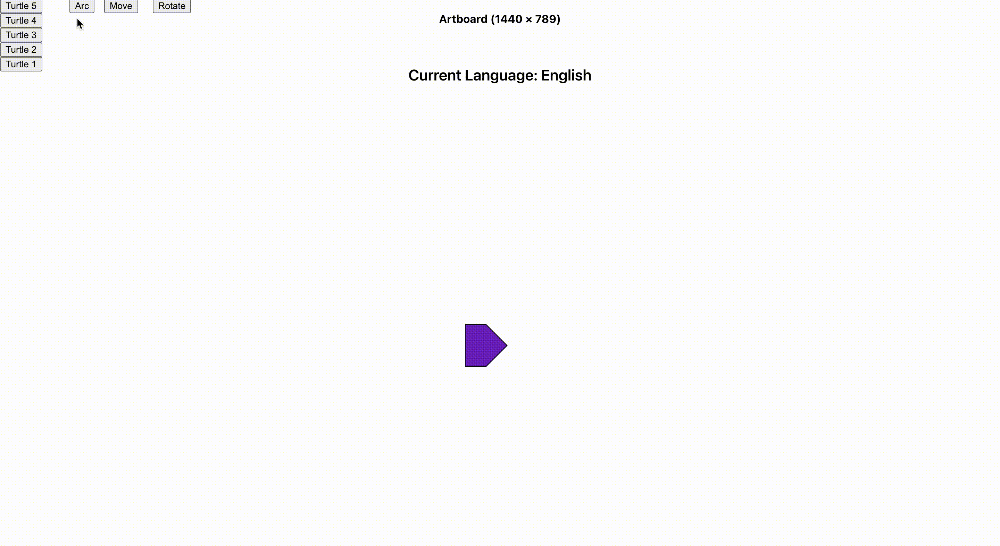
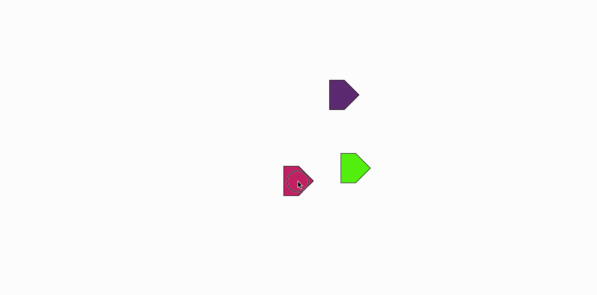

# Google Summer Of Code 2021 - Final Work Product
 
### sugarlabs/[musicblocks](https://github.com/sugarlabs/musicblocks-v4) 
### author:joykirat ([Joykirat Singh](https://github.com/joykirat18)) 
 

#### Project Details 
- Project Title: [MusicBlock-v4 Palettes and Artboard Canvas ](https://summerofcode.withgoogle.com/projects/#6238459439611904)
- Proposal: [Proposal](./prop.pdf)
- Organization: [Sugarlabs](https://github.com/sugarlabs/)
- Mentors : [Anindya Kundu](https://github.com/meganindya) &ensp;&ensp;&ensp;&ensp;&ensp;&ensp;&ensp;&ensp;&ensp;[Peace Ojemeh](https://github.com/perriefidelis) &ensp;&ensp;&ensp;&ensp;&ensp;&ensp;&ensp;&ensp;&ensp;[Walter Bender](https://github.com/walterbender) 
            &ensp;&ensp;&ensp;&ensp;&ensp;&ensp;&ensp;&ensp;&ensp;[Devin Ulibarri](https://github.com/pikurasa) 
            &ensp;&ensp;&ensp;&ensp;&ensp;&ensp;&ensp;&ensp;&ensp;

## Abstract/Summary 
MusicBlocks is being refactored from scratch, so this gives us the opportunity to work on a new improved version of the project, with the lastest tech stacks and enhanced performance.
Spending the summer of 2021 working on MusicBlocks-v4 and it has been an amazing experience. 
I'm very grateful to Sugarlabs for accepting my contributions and supporting me through the process building the new musicBlock. 
For the past 4 months I, along with my peers, have been working tirelessly on 4 different major components i.e ArtBoard(canvas), palette, Menus and Blocks. I took the responsibilities of building the palette section and functionality of drawing on the artBoard canvas. Also made sure that the performance of the new components build was better then the previous version of musicBlocks. 

This is a description of my work on [MusicBlock Palette and Canvas](https://summerofcode.withgoogle.com/projects/#6238459439611904) during Google Summer Of Code 2021 with [Sugar Labs](https://github.com/sugarlabs/). This repository contains the work done, the code and the documentation written by me for the project.

---
&nbsp;

## Tech Stacks

The new musicBlock is build using React + Typescript. This discussion was taken to improve the performance and the code quality of the project. React virtual dom helps in improve the performanceand strict type checking using typescript over javascript helps in improving the code quality. 
The palette was build using functional components and various hooks.  
[p5](https://p5js.org/) library is used to create and handle canvases. p5 provides many inbuilt functions to draw graphics and control over the canvas.p5.js has a number of predefined functions which we can use to draw anything we want. The most basic (and necessary) functions are the setup() and draw() functions.  A simple canvas using p5 in react can be created like this.

[`p5 Canvas is created in instance mode.`](https://github.com/processing/p5.js/wiki/Global-and-instance-mode)

    const Sketch = (sketch: P5Instance): void => {
        let demoCanvas: p5.Element;

        /** This is a setup function */
        sketch.setup = () => {
            demoCanvas = sketch.createCanvas(1200, 600);
        };

        /** This is a draw function */
        sketch.draw = () => {
            sketch.background(220);
            sketch.ellipse(50, 50, 80, 80);
        };
    };

It creates a canvas as p5 element with a circle on top of it. There are two important functions `setup` and `draw`. The code inside the `draw()` function runs continuously from top to bottom until the program is stopped. The setup function runs only once in the beginning. 

By using React we get all the advantages of declarative code with clean, reusable and reactive components. All the while still maintaining the easy to use abstractions exposed by p5. The above sketch defintion is called inside a react component. 

## Work Progress

During the community Bonding Period, we brainstromed to the decide the tech stack we were going to use and the architecture of the project. We decided to go for MVVM architecture. Model — View — ViewModel (MVVM) is the industry-recognized software architecture pattern that overcomes all drawbacks of MVP and MVC design patterns. MVVM suggests separating the data presentation logic(Views or UI) from the core business logic part of the application. 

The separate code layers of MVVM are:
<ul>
<li>
Model: This layer is responsible for the abstraction of the data sources. Model and ViewModel work together to get and save the data.
<li>
View: The purpose of this layer is to inform the ViewModel about the user’s action. This layer observes the ViewModel and does not contain any kind of application logic.
<li>
ViewModel: It exposes those data streams which are relevant to the View. Moreover, it servers as a link between the Model and the View.
</ul>

My 10 weeks of work on the project was divided into 2 parts: **Building the palette**, **Building artBoard Functionlity**. 

&nbsp;

## Building the palette

The palette is a crucial part of MusicBlock. It is were all the blocks are divided into different sections and the user can select the different blocks.

MVVM architecture is followed to build the pallette.

The viewModels are palette.ts and PaletteBlock.ts. THe palette.ts is responsible for showing the palettes sections and subSections. The palette.ts viewModel calls the palette.tsx view to render the subSections. 

The paletteBlocks is used to show the PopUp containing all the blocks. It divides the block into low Shelf and high Shelf blocks.

<ol>
<li> High Shelf Blocks: The high shelf blocks contain the blocks mostly used by the user and can be easily found.
<li> Low Shelf Blocks: The low shelf blocks contain blocks that are rarely used and can be grouped with other blocks.
</ol>

PopUp.tsx is the view for the PopUp and is responsible for how the low and high shelf blocks are shown.

For more details on the structure of the palette you can see the full documentation [here](./Palette.md).

&nbsp;

## Building ArtBoard Functionlity
The artBoard is the canvas where the user can draw using the turtle. The user can perform 4 functionlity on the turtle:
<ul>
<li> Move turtle forward/backwards
<li> Rotate turtle clockwise/counter clockwise
<li> Move turtle in an arc
<li> Draw and drop turtle
</ul>
The artBoard is build React + p5.js. The artBoard is divided to 2 parts, artBoardSketch.tsx and artBoardTurtle.tsx . The artBoardSketch is responsible for drawing the lines on the canvas, and the artBoardTurtle renders the turtle on canvas. Each turtle is linked to a canvas. If the user wants to create N turtles then N artBoardSketch will be created and N turtles will be rendered on the artBoardTurtle canvas. So in total N + 1 canvases will be created.

The user can define the angle, the disctance and the speed of the turtle.The detail on the functionality and the structure of the artBoard you can see the full documentation [here](./artBoardView.md).

### Moving turtle forward

### Moving turtle in Arc

### Dragging and dropping turtle

The 2 models `artBoardDraw.ts` and `turtle.ts` are used to store the canvas and turtles created respectively.They are called by the artBoardSketch.tsx and artBoardTurtle.tsx respectively. For more detail on the structure of artBoard model you can see the full documentation [here](./ArtBoardModel.md).

 PR | Description
 ------ | ------ 
[70](https://github.com/sugarlabs/musicblocks-v4/pull/70) | The MVVM architecture is used to build the palette. The basic styling is completed and blocks are divided into high and low shelf.
[74](https://github.com/sugarlabs/musicblocks-v4/pull/74) | The move functionality of the turtle is added. The  user can move the turtle around the canvas and also specifify the number of turtles to render on canvas.
[85](https://github.com/sugarlabs/musicblocks-v4/pull/85) | A lot of props were being passed around the views, so wrapped the artBoard in a context API layer to clean up some of the code.
[86](https://github.com/sugarlabs/musicblocks-v4/pull/86) | The turtle can be dragged and dropped on the canvas. The top mose turtle is always get priority while 2 turtles are overlapping. 
[90](https://github.com/sugarlabs/musicblocks-v4/pull/90) | Disabled mouse events on the turtle, when it is moving. Due to this only stationary turtles can be dragged and dropped. 
[91](https://github.com/sugarlabs/musicblocks-v4/pull/91) | ArtBoard Canvas Documentation.
[92](https://github.com/sugarlabs/musicblocks-v4/pull/92) | Palette Documentation.

## Furthur Enhancement
<ul>
<li> Improve the design of the palette.
<li> Users can make their own low shelf and high shlef blocks category.
<li> The popUp can expand to full screen and user can drag and drop the popUp to any position.
<li> Connect the palette with the blocks frameWork.
<li> Add more different turtle Shapes.
<li> Improve the performance of the artBoard.
</ul>

---
&nbsp;

On a final note, I am extremely grateful to my mentors, [Anindya Kundu](https://github.com/meganindya), [Walter Bender](https://github.com/walterbender), [Peace Ojemeh](https://github.com/perriefidelis), and [Devin Ulibarri](https://github.com/pikurasa). I am also very thankful for their motivation which helped me in improving the quality of my code and helping me improve my soft skills.

Thanks to [Sugarlabs](https://www.sugarlabs.org/) and [MusicBlocks](https://musicblocks.sugarlabs.org/) for this great opportunity.

Thanks

Joykirat Singh

